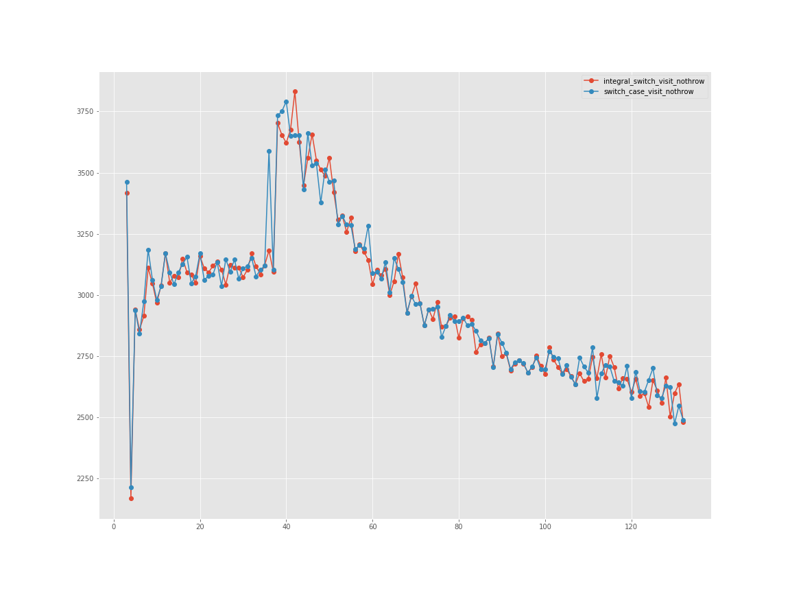

# Benchmarks

Benchmarking is done against "hand-rolled" switch-case statements. The benchmark problem is inspired by mpark variant's [execute.mpark.cpp](https://github.com/mpark/variant/blob/benchmark/visit.1/execute.mpark.cpp)



```
number                             4        8        16       32       64       128
implementation                                                                     
integral_switch_visit_nothrow  2168.70  3110.49  3149.30  3170.34  2999.82  2662.73
switch_case_visit_nothrow      2214.68  3185.18  3127.04  3150.91  3011.64  2629.04
```
