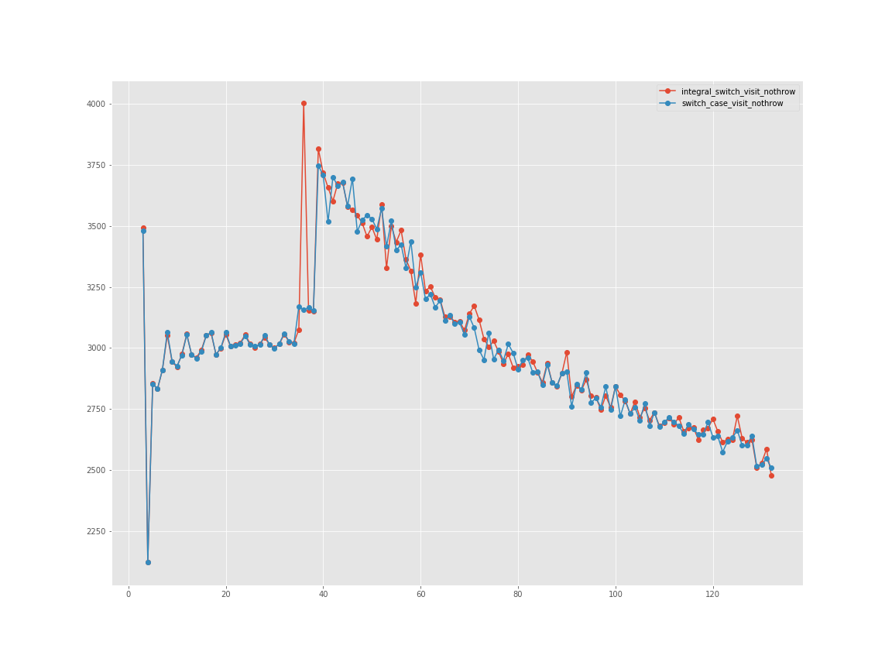

# Benchmarks

Benchmarking is done against "hand-rolled" switch-case statements. The benchmark problem is inspired by mpark variant's [execute.mpark.cpp](https://github.com/mpark/variant/blob/benchmark/visit.1/execute.mpark.cpp)



```
number                             4        8        16       32       64       128
implementation
integral_switch_visit_nothrow  2121.72  3052.87  3052.58  3056.58  3198.63  2624.96
switch_case_visit_nothrow      2121.05  3064.34  3050.43  3059.24  3194.24  2640.61
```
